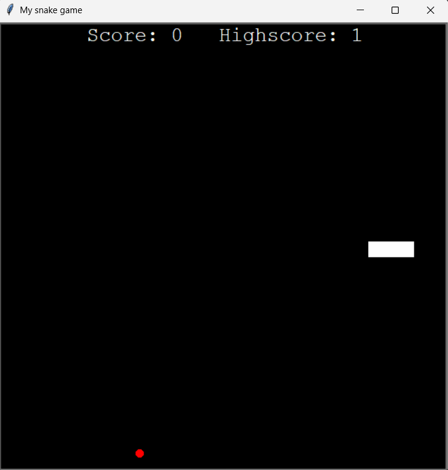

# 🐍 The Snake Game

A classic Snake game implemented in Python using the turtle module.  
Eat food to grow the snake, avoid collisions, and try to beat the persistent high score!

---

## ▶ Demo
Add a screenshot or short GIF named screenshot.png or demo.gif to the repo root and it will show here:



---

## ⚙ Quickstart — Run locally

1. Clone the repo:
```bash
git clone https://github.com/HarshCh16/The-Snake-Game.git
cd The-Snake-Game
```
2. Run the game:
   ```bash
   python main.py
   ```
**Controls**
-Arrow keys - Move the snake

---

## 🧠 What I learned building this
- Game loop control with *turtle* abd timed callbacks
- Managing snake body segments & collision detection
- Simple file for saving persistent state

---

## 🧩 Features
- Smooth snake movement and food spawning
- Score display and persistent high score between runs
- Configurable speed,grid size and colors

---

## 🏷️ Tech Stack
**Language**: Python\
**Libraries**:
- *turtle* - for on-screen graphics
